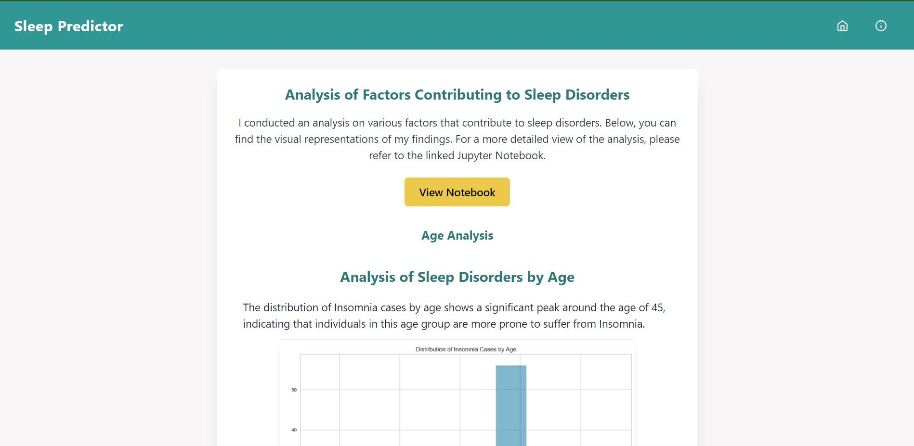
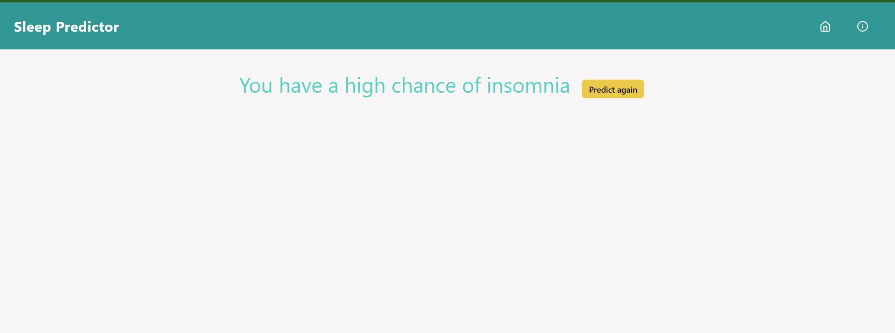

# Sleep-Disorder
This is a web application for predicting sleep disorders based on various health and lifestyle factors. The website uses machine learning models to analyze user input and provide predictions about potential sleep disorders. It is built using Python, Flask, and other libraries for data processing and visualization.
# Screenshots
### Home page

### After submission

### About page

# Jupyter Notebook link
https://notebooksharing.space/view/51a2cdf80dd1abe804201912270a33337761ee8473804f4a55cd1e2cc98c5351#displayOptions=
# Features
User Input: Users can enter their age, gender, occupation, sleep duration, quality of sleep, physical activity level, stress level, heart rate, daily steps, BMI category, and blood pressure.
Prediction: The website processes the user's input through a trained machine learning model to predict the likelihood of different sleep disorders, such as insomnia or sleep apnea.
Visualization: Visualizations are provided to showcase the relationships between different features and sleep disorders, helping users better understand the results.Refer notebook for better analysis.
# Getting Started
To run this website locally on your machine, follow these steps:

- Clone the repository to your local machine.
- Install the required libraries by running pip install -r requirements.txt.
- Run the Flask application using python app.py.
- Access the website in your web browser at http://localhost:5000.
# Data Preprocessing and Model Training
The dataset used for training the machine learning model contains various health and lifestyle features along with labels indicating the presence or absence of sleep disorders. The data is preprocessed to handle missing values and convert categorical features into numerical representations. The processed data is then split into training and testing sets.

The chosen machine learning model for sleep disorder prediction is logistic regression, which has shown good performance for multiclass classification tasks. The data is scaled using the StandardScaler to ensure that all features are on a similar scale, which can enhance model performance.
